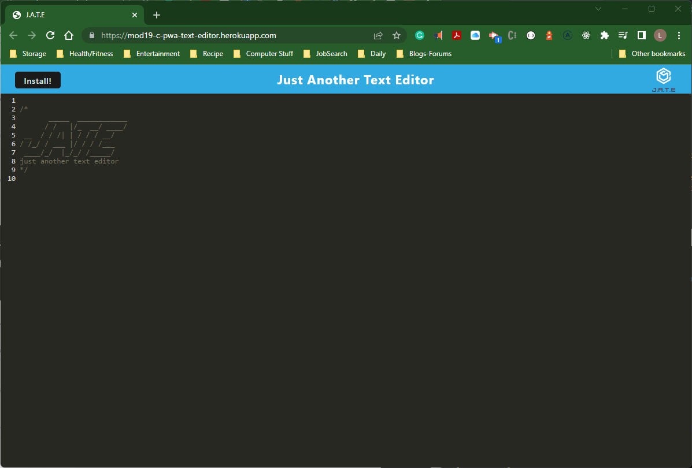

# <center><font color="blue">**MOD19-C-PWA-Text-Editor**</font></center>
PWA Text Editor JATE Just Another Text Editor

[](https://opensource.org/licenses/MIT)

## Description

Creates text editor using the webpack and service workers.

## Table of Contents
  
- [User Story](#userstory)
- [Acceptance Criteria](#acceptance-criteria)
- [Installation](#installation)
- [Usage](#usage)
- [Credits](#credits)
- [License](#license)
- [Feature](#features)
- [How to Contribute](#contribute)
- [How to Test](#test)
- [Contact Info](#contact) 

## User Story

```md
AS A developer
I WANT to create notes or code snippets with or without an internet connection
SO THAT I can reliably retrieve them for later use
```

## Acceptance Criteria

```md
GIVEN a text editor web application
WHEN I open my application in my editor
THEN I should see a client server folder structure
WHEN I run `npm run start` from the root directory
THEN I find that my application should start up the backend and serve the client
WHEN I run the text editor application from my terminal
THEN I find that my JavaScript files have been bundled using webpack
WHEN I run my webpack plugins
THEN I find that I have a generated HTML file, service worker, and a manifest file
WHEN I use next-gen JavaScript in my application
THEN I find that the text editor still functions in the browser without errors
WHEN I open the text editor
THEN I find that IndexedDB has immediately created a database storage
WHEN I enter content and subsequently click off of the DOM window
THEN I find that the content in the text editor has been saved with IndexedDB
WHEN I reopen the text editor after closing it
THEN I find that the content in the text editor has been retrieved from our IndexedDB
WHEN I click on the Install button
THEN I download my web application as an icon on my desktop
WHEN I load my web application
THEN I should have a registered service worker using workbox
WHEN I register a service worker
THEN I should have my static assets pre cached upon loading along with subsequent pages and static assets
WHEN I deploy to Heroku
THEN I should have proper build scripts for a webpack application
```

## Visual Documentation

The following is a Link to Deployed website from **Heroku**:

[](https://mod19-c-pwa-text-editor.herokuapp.com/)
***

## Installation

This is deployed using Heroku for the IndexedDb. The link is above.
To install using GitHub. Initialize npm to produce the package.json file.

Type npm run install. 
In the command line, type npm start.

## Usage
- JavaScript with Node.js - base coding language

- Server-side dependencies
  - Production - Express
  
  - Developmental - Nodemon

- Client-side dependencies
  - Developmental
    -  Babel,
    -  CSS-loader,
    -  Webpack,
    -  Style loader
  
  - Production
    - Code Mirror Themes,
    - IndexedDb

## Credits

I would like to thank my TA's and instructor and the, maybe, accidental, additional help in the source code.

## License

This application is using the The MIT License License. Click on the badge  [](https://opensource.org/licenses/MIT)  to follow the link to the license.

---

## Features


## How to Contribute

This application follows the [Contributor Covenant](https://www.contributor-covenant.org/).

If you would like to contribute it, you can create an issue on GitHub repository at https://github.com/LRicciardo/MOD19-C-PWA-Text-Editor. 

## Tests


  
## Contact Info

This application follows the [Contributor Covenant](https://www.contributor-covenant.org/).

If you would like to contact me about an issue, you can send an email to Liane.Ricciardo@gmail.com.
